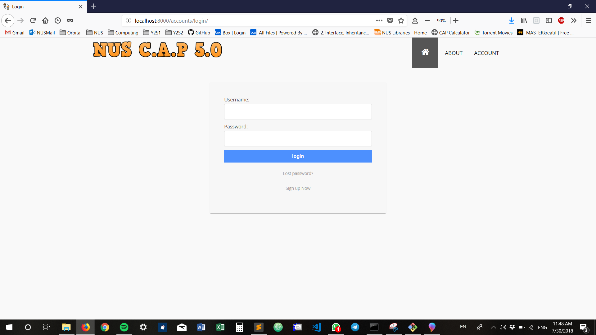

 Group Members: 
 1. **JACK CHEN**
 2. **CHAN QING ZHOU**
 Proposed Level of Achievement: **Gemini**

# Problem Description

Currently, NUS releases past year papers on NUSLib. However, answers for these papers are not released. As a result, students are unable to check whether the work they do is correct. In addition, there is no centralised platform for students to share and discuss their answers for the past year papers. We hope to create a community-based platform for students in NUS to upload their answers for the past year paper and discuss their answers.

# Project Scope
NUSCAP5 aims to provide a centralised platform for students of NUS to find answers for past year papers online and allow students to discuss their answers online. This will allow others to comment on the answers posted by users. 

# Poster

# Features
These are some of the features our web app will provide:

1. **CRUD** - Users can create user profiles (Create), view answers shared by other users (Read), delete or update their answers (Update), and remove their answers (Delete)

2. **Search function** to search for PYP answers

3. Grouping into respective **Faculties > Modules > Year, Semester of Paper**

4. **Upvote/downvote system** to show the most accurate answers posted by users

5. **Uploading photos/documents** to show answers

6. **Comments section** to discuss answers posted by users

# How we are different from other platforms
1. **IVLE Forums**
  a. Official forums like IVLE do not have dedicated threads or forums to allow sharing of answers for past year papers
  b. There is no upvote/downvote system
  
2. **Dropbox**
  a. Inability to discuss answers/ask further questions/develop more ideas from the questions
  b. Students are unwilling to post their own answers online because they are unsure of the accuracy of their answers

# **Tech Stack**
**(Updated)**
1. Frontend: 
  -HTML, CSS, JS
  
 
 
 
2. Backend: 
  -Django Framework (Python)
  
  

# Timeline

## **Milestone 1** (Completed)
**Deliverables**
1. README 
2. Project Log (https://tinyurl.com/ybq6m8vb)
3. Video (https://tinyurl.com/y7ya2g96)
4. Poster (Removed)

We hope to be able to have our basic idea for our project by the end of Milestone 1 and to learn by ourselves the essential skills and tech stack required for our project. We have chosen to build an Android App for this and we will require to be able to make use of Android Studio and basic Java to do so.

We did some initial planning by brainstorming what motivates us and what solutions we want to bring about for existing problems. We also decided to divide our work into front-end developing (Jack) and back-end developing (Main programmer will be Qing Zhou and Jack will help to integrate the backend and frontend)

**UPDATE**
After Milestone 1 reviews, we have decided to switch to web-applcation instead. See below for more information.
 

## **Milestone 2** (Completed)
**Deliverables**
1. README (This file xD)
2. Project Log (https://tinyurl.com/ybq6m8vb)
3. Video (https://youtu.be/wTMVcciaejA)
4. Poster (Removed)

For Milestone 2, upon reading the feedback from Milestone I, we decided to change our project into a web-based application instead of a mobile application. We plan to create a web-based application using Django framework. This web application will allow students to post their own answers for PYP. These answers will be reviewed by other users in the community to verify that the answers are accurate. 

We quickly changed our focus to reading up on HTML, CSS, JS for frontend programming, as well as using Django for backend programming. 

## **Functionalities Available Now**
1. Basic authentication and logging in functions
2. Upvote and downvote system
3. Uploading of documents
4. Adding your own module code and name
5. Adding comments

### **Milestone 3** 

**Deliverables**
1. README
2. Project Log (https://tinyurl.com/ybq6m8vb)
3. Video (link)
4. Poster (See above, or https://tinyurl.com/ydfgfz42)

After feedback from peers in Milestone II, we have improved on our website and these are the functionalities that we have included:

## **Functionalities included in Milestone 3**
1. User profile pages, editing of profile pages
2. Deletion of files uploaded by users
3. Auto update of modules (synced with NUSMODs)
4. Refining UX/UI of login/signup
5. Password reset/changing of password functionalities

## **Preview** 
### Home Page (Logged out)

### Home Page (Logged In)

### Navigation Bar (Not logged in)

### Navigation Bar (Logged In)

### Login page 

### Registration page

### Password Reset 

### Faculties

### Searching for Modules

### Modules

### Year 

### Uploaded Answers

### Comments Section
